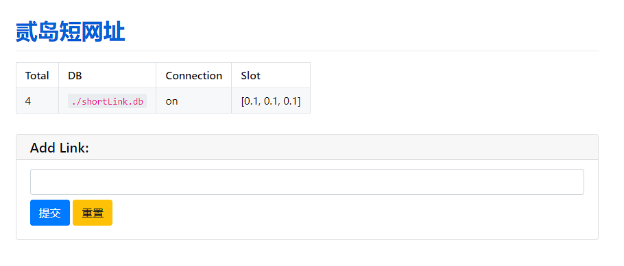

# ShortenURL
A simple link shorten service, database powered by SQLite


# Usage
Complete the `config.json` to meet your demand: 

`blacklist`: ban adding this url

`baseURL`: short url service base url

`sqliteAddress`: sqlite address

`shift_possibility`: range from (0, 1), the larger, the better effect, but may lower the efficiency with mass data

`min_length`: min length for shorten address

`max_length`: max length for shorten address, set as `-1` for ultimate

`support_url_pattern`: regex validation for input url

```json
{
   "blacklist":[
      "https://sample2.com"
   ],
   "baseURL":"https://sample.com",
   "sqliteAddress":"./shortLink.db",
   "shift_possibility": 0.6,
   "min_length": 4,
   "max_length": -1,
   "support_url_pattern":"http[s]?://(?:[a-zA-Z]|[0-9]|[$-_@.&+]|[!*\\(\\),]|(?:%[0-9a-fA-F][0-9a-fA-F]))+"
}
```
then config `service.ini` to set the web server:
```ini
[SERVICE]
title=Web Title
link=https://sample.com
proxy=1145
```
finally, run `sh start_service.sh` and enjoy!

**kill service:** run `ps -ef | grep python` to check service pid, then, `kill pid`

# ShortURL 
the class that handle link shorten service, config `config.json` and use as below:
```python
import ShortURL

func = ShortURL.ShortURL()

# add link
result = func.add("https://erdao.me")  # 1000 items in 1.7s safe mode

# check total length
print(func.len())

# check from original link / short link
result = func.get("https://erdao.me")
print(result)

# service status
print(func.status())

# don't forget to close the session after use
func.close()
```
